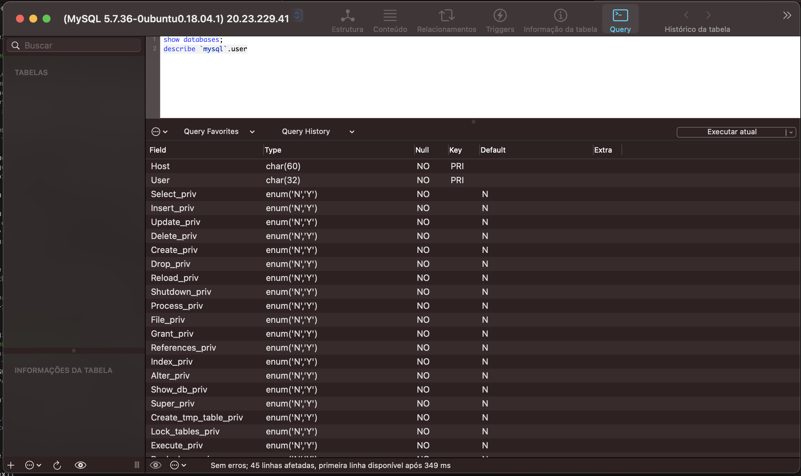

# Infrastructure and Cloud Architecture

## Especifico academico - Criando arquitetura IAC com Terraform - MBA AS_03

### Equipe C - "Katie Bouman"
#### Membros que componhem esse trabalho:

- Francisco Edson A Nascimento
- Beatriz Maciel Costa
- Janilson Dias de Oliveira
- Michael Douglas B. Silva
- Roberto Pires de Oliveira

### Visão geral da Arquitetura:

 


#### Para rodar este projeto devera ter os seguintes items:

- Terraform - [Download](https://learn.hashicorp.com/tutorials/terraform/install-cli?in=terraform/azure-get-started)

Uma conta na Microsoft Azure 

- Azure - [Cadastro](https://azure.microsoft.com/en-us/free/search/?&ef_id=CjwKCAiAxJSPBhAoEiwAeO_fPzv9nguWqfSEHPwOVaTLoYG9mcqLX1ooBjHV2hEPLCJBIoSc73Lh6hoCz4UQAvD_BwE:G:s&OCID=AID2200154_SEM_CjwKCAiAxJSPBhAoEiwAeO_fPzv9nguWqfSEHPwOVaTLoYG9mcqLX1ooBjHV2hEPLCJBIoSc73Lh6hoCz4UQAvD_BwE:G:s&gclid=CjwKCAiAxJSPBhAoEiwAeO_fPzv9nguWqfSEHPwOVaTLoYG9mcqLX1ooBjHV2hEPLCJBIoSc73Lh6hoCz4UQAvD_BwE)
- Azure CLI - [download](https://docs.microsoft.com/pt-br/cli/azure/install-azure-cli)
- 
#### Como rodar o projeto:

 - Fazer o clone [https://github.com/fean-developer/infrastructureCloudTerraform.git](https://github.com/fean-developer/infrastructureCloudTerraform.git)
 - Fazer login na Azure via terminal 
 ``` az login```
 
 - Variaveis de ambiante para conexao ssh na VM
 
 ```TF_VAR_vm_password=<vm-password>```
 
 - Alterar variavel ``vm_user`` no arquivo ``terraform.tfvars``
 
 - Com o terraform instalado

   Comandos:
   
   ```terraform validate```
   ```terraform plan```
   ```terraform apply```
   
   ### Evidência 001 - User root connect mysql by ssh - SGBD - Squel Ace
   
   
   
   ### Evidência 001 - User root connected mysql by ssh and describe table Mysql.user - SGBD - Squel Ace
   
    
  
